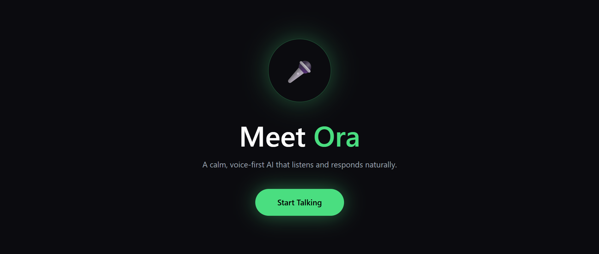
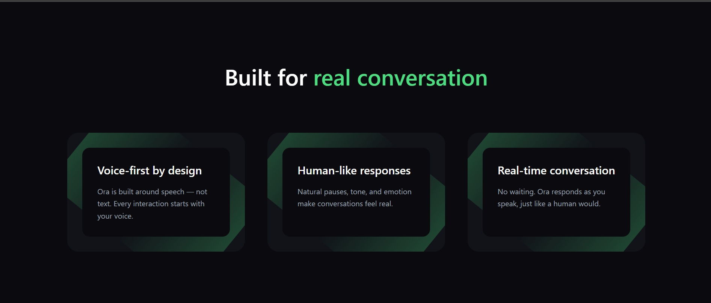
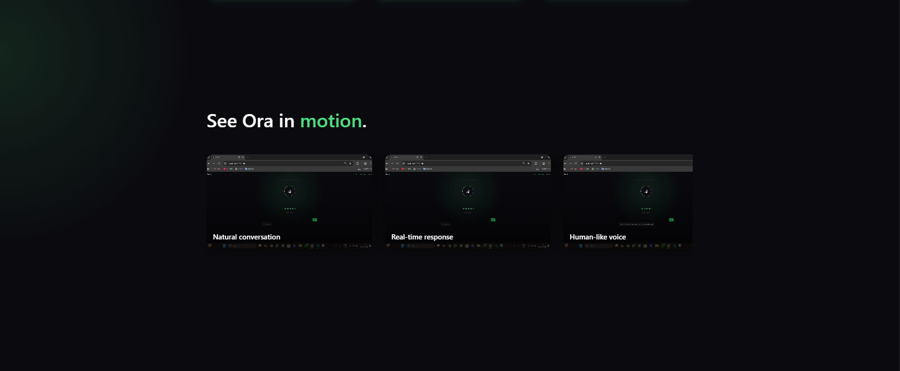
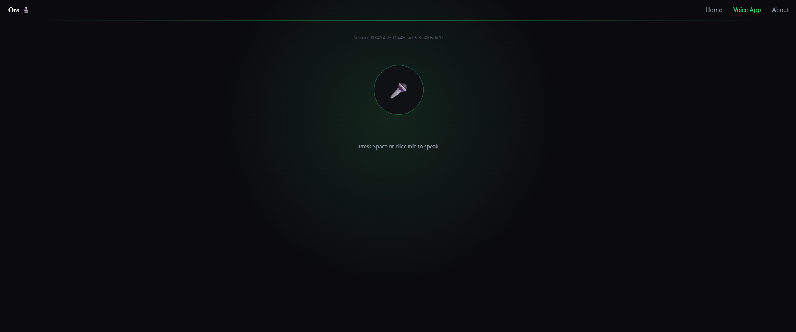
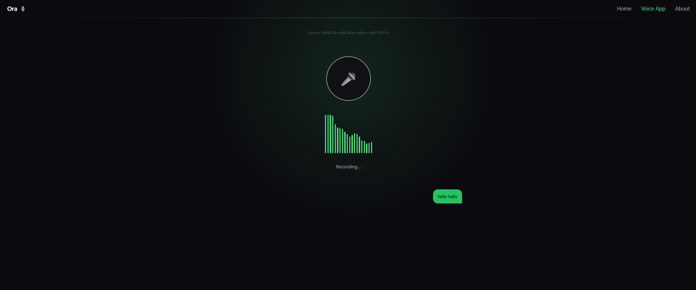
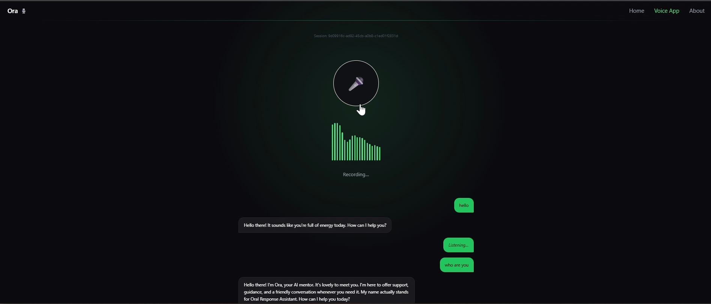
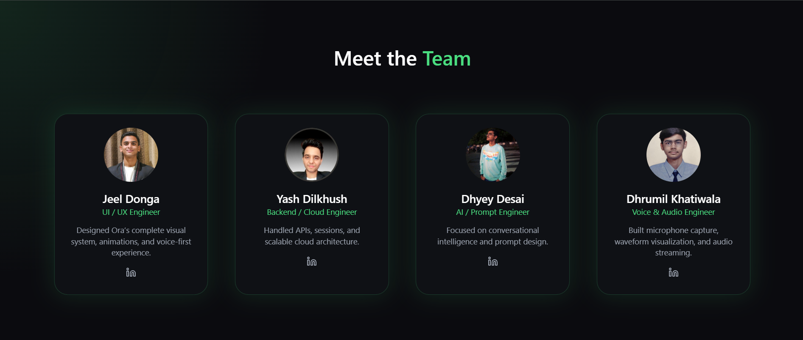
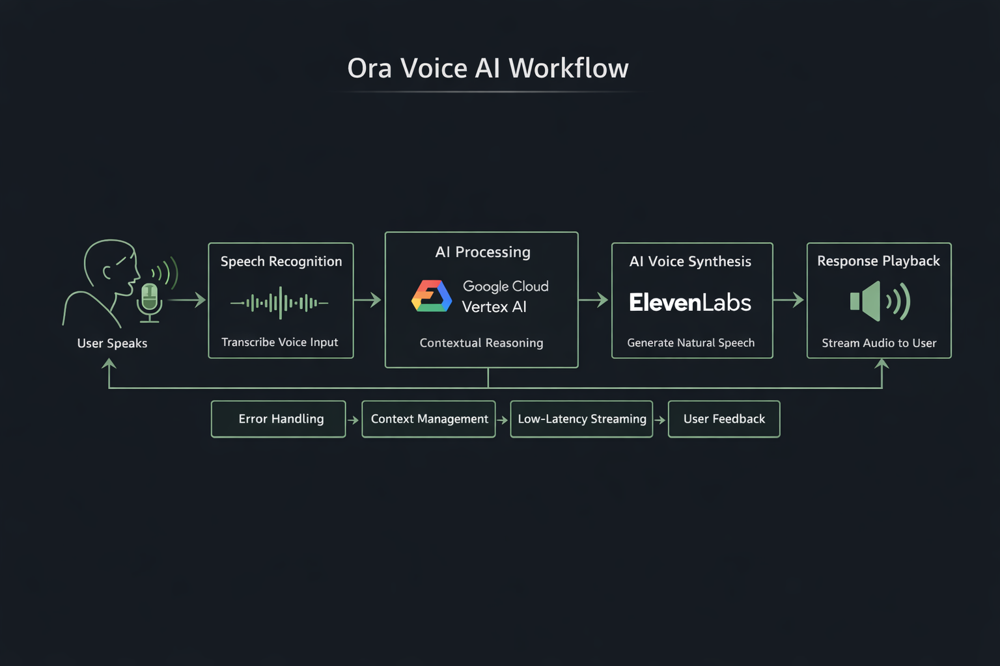

# 🎙️ Ora — Voice-First Conversational AI

Ora is a **voice-driven conversational AI interface** designed to feel **natural, interruptible, and human**.  
Built for the **ElevenLabs × Google Cloud AI Challenge**, Ora enables users to interact **entirely through speech**, combining real-time audio capture, intelligent reasoning, and expressive AI voice responses.

---

## 📑 Table of Contents

- Demo
- Core Features
- Pages Overview
  - Landing Page
  - Voice App
  - About Page
- Workflow of Ora
- Pros & Cons
- Future Advancements
- Team
- Tech Stack
- Credits & Acknowledgements
- Contact
- Final Note

---

## 🌐 Demo

- 🔗 **Live Demo:** https://ora-voice-ai.vercel.app/
- 🎥 **Full Working Demo (1–2 min):** https://youtu.be/_2RcQeoFwm4?si=3qeJZRzhpEERQlbY

---

## ✨ Core Features

- 🎤 Push-to-Talk Voice Interaction (Mouse + Spacebar)
- 🧠 Context-Aware AI Conversations
- 🔊 Human-Like AI Voice (ElevenLabs)
- 📊 Real-Time Waveform Feedback
- 🔁 User-Controlled Conversation Flow (Interrupt & Restart)
- 🎨 Dark Minimal UI with Soft Green Theme
- ⚡ Optimized, Low-Perceived-Latency Session-Based Flow

---

## 🖥️ Pages Overview

---

### 🏠 Landing Page

The landing page introduces Ora with **high-impact visuals and smooth animations**.

**Includes:**
- Animated hero section
- Feature cards with glow effects
- Carousel showcasing real UI usage
- Voice experience preview
- CTA & footer

📸 **Screenshots:**

---

### 🎙️ Voice App (Working Page)

This is the **core voice-first experience** of Ora.

**Capabilities:**
- Microphone permission handling
- Push-to-talk interaction
- Dynamic waveform per system state
- Live conversation bubbles (User ↔ AI)
- AI responses with streamed voice playback
- Error & interruption handling
- Session-aware conversation flow

📸 **Screenshots:**

---

### 👥 About Page

The About page presents the **team, internal workflow, and technology credits** in a clean and professional layout.

📸 **Screenshots:**

---

## 🔄 Workflow of Ora

Ora follows a structured, real-time voice interaction pipeline:

1. User grants microphone access
2. Audio is captured in real time
3. Speech segments are detected
4. AI reasoning powered by Google Gemini
5. Context-aware response generation
6. Voice synthesis via ElevenLabs
7. Audio streamed back to the user
8. System states manage interruptions and errors

This architecture ensures a **low-latency, human-like conversational experience**.

---

## ⚖️ Pros and Cons

| ✅ Pros | ⚠️ Cons |
|------|------|
| Fully voice-first interaction | No persistent cloud storage |
| Hands-free push-to-talk UX | Session resets on refresh |
| Human-like AI voice | Browser-dependent STT |
| Real-time waveform feedback | Web Speech API limits |
| Context-aware conversations | Single-language support |
| Runs entirely in browser | No wake-word activation |
| Clean session-based architecture | No user authentication |
| Deployed end-to-end system | Limited mobile optimization |

---

## 🚀 Future Advancements

- Add cloud storage for persistent conversations
- Add User Authentication and with Database and OAuth
- Replace Web Speech API with Whisper-based STT
- Enable multi-language voice support
- Implement streaming Gemini responses
- Add wake-word activation (“Hey Ora”)
- Make TTS playback fully interruptible
- Improve mobile-first UI and performance

---

## 🧑‍💻 Team

| Name | Role |
|----|----|
| **Jeel Donga** | UI / UX Engineer — Visual system, animations, voice-first UX |
| **Yash Dilkhush** | Backend & Cloud Engineer — APIs, sessions, architecture |
| **Dhyey Desai** | AI & Prompt Engineer — Conversational intelligence |
| **Dhrumil Khatiwala** | Voice & Audio Engineer — Mic capture, waveform, audio streaming |

---

## 🧠 Tech Stack

### Frontend
- React.js
- Tailwind CSS
- Framer Motion
- React Router

### AI & Voice
- ElevenLabs — AI Voice Synthesis
- Gemini — Conversational Intelligence

### Browser APIs
- Web Audio API
- Web Speech API

---

## 🙏 Credits & Acknowledgements

We sincerely thank:

- **Google Gemini**
- **ElevenLabs**

for enabling intelligent reasoning and expressive, human-like voice synthesis.

---

## 📬 Contact

📧 **Email:** jeeldonga18@gmail.com  
📧 **CC:** dhyeydesai2626@gmail.com, yashdilkhush96@gmail.com, dhrumilkhatiwala@gmail.com  
💬 **Subject:** *Collaboration with Ora or Query about Ora*

---

## ⭐ Final Note

Ora is not just a demo — it is a **foundation for future voice-first human–AI interaction**, built with a strong focus on UX, performance, and realism.